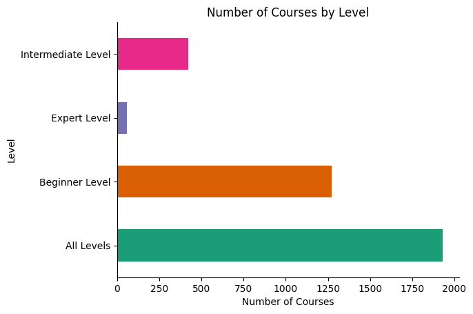
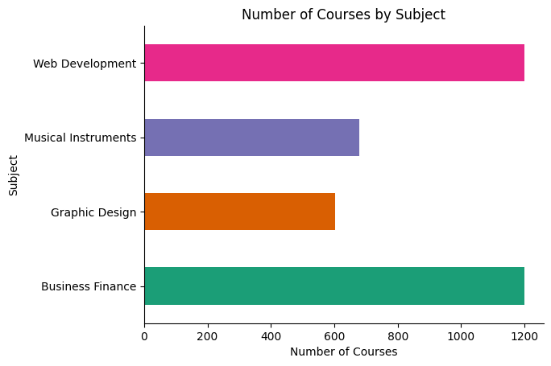

# Udemy-Data-Analysis
Udemy Data Analysis notebook project. This project analyzes a dataset of Udemy courses to gain insights into course trends, pricing, and popularity. Created using Google collab


## Project Structure 
```plaintext
udemy_project/
├── data/
│   └── Udemy_Dataset.csv
├── notebooks/
│   └── analysis.ipynb
├── src/
│   └── cleaning.py
├── visualizations/
│   ├── Highest_Selling_Courses.png
│   ├── is_paid.png
│   ├── level.png
|   ├── subject.png
|   └── udemy_python_courses_chart.png
└── README.md
```

## Data Cleaning

The cleaning.py script handles common data cleaning tasks such as:

- Handling missing values
- Converting data types
- Removing duplicates (if necessary)
- Handling outliers (if necessary)
- Standardizing/normalizing numerical features (if necessary)
- Cleaning text data (if necessary)

## Data Analysis and Visualizations

The analysis.ipynb notebook contains the following visualizations:

### 1. Distribution of Free and Paid Courses (2D Pie Chart)


This pie chart shows the percentage distribution of free and paid courses on Udemy.

### 2. Top 10 Selling Courses (Horizontal Bar Chart)


This horizontal bar chart displays the top 10 selling courses based on the number of subscribers.

### 3. Percentage of Python Courses (Pie Chart)


This pie chart illustrates the proportion of Python courses compared to all courses on Udemy.

### 4. Number of Courses by Level (Horizontal Bar Chart)



This bar chart illustrates the amount of courses at each of these 4 levels : beginner, intermediate, expert and all levels on Udemy.

### 5. Number of Courses by Subject (Horizontal Bar Chart)



This bar chart illustrates the number of courses by these Subjects: Web Development, Musical Instruments, Graphic Design, Business Finance on Udemy.

## Key Findings

* **Paid courses dominate the platform by 83%.**
* **Specific courses stand out as top sellers:.**
* **Python courses represent a small but significant portion.**

## Future Work

### Further Analysis

- **Time-Series Analysis:** Investigate trends in course creation, enrollment, and pricing over time. Identify seasonal patterns or long-term shifts in the platform's offerings.
- **Content Depth Analysis:** Go beyond keyword analysis and delve into the actual course content (if accessible). Analyze the structure, length, and complexity of courses to understand what resonates with learners.
- **Student Demographics and Engagement:** If data is available, explore student demographics and their engagement patterns (e.g., completion rates, time spent on platform). This could reveal insights into learner preferences and successful learning strategies.
- **Competitive Analysis:** Compare Udemy's offerings and pricing with other online learning platforms (e.g., Coursera, Skillshare). Identify areas of strength and potential opportunities for differentiation.

### Project Expansion

- **Interactive Dashboard:** Create an interactive dashboard using tools like Plotly Dash or Streamlit to allow users to explore the data and visualizations dynamically.
- **Recommendation System:** Develop a recommendation system that suggests courses to users based on their interests, past enrollments, or demographic information.
- **Sentiment Analysis:** Analyze course reviews to understand learner sentiment towards different courses and instructors. Identify areas for improvement and highlight positive feedback.
- **Web Scraping:** Expand the dataset by scraping additional information from Udemy or other platforms to enrich your analysis.

## How to Run

1. Clone this repository.
2. Open the analysis.ipynb notebook in Google Colab.
3. Execute the code cells to generate the visualizations.

## Dependencies

- pandas
- numpy
- matplotlib
- seaborn
- plotly
- kaleido
